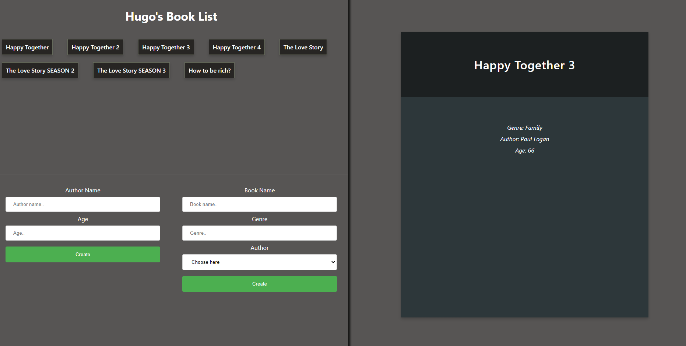

# Graphql-React-Book-Playground

# Tech Stack

-   React & React Hooks
-   GraphQL
-   Express.js
-   MongoDB

# Project Environment Vars

There both exists one `.env` file in `client-app` folder and `server` folder.
Feel free to modify it based on your need.
